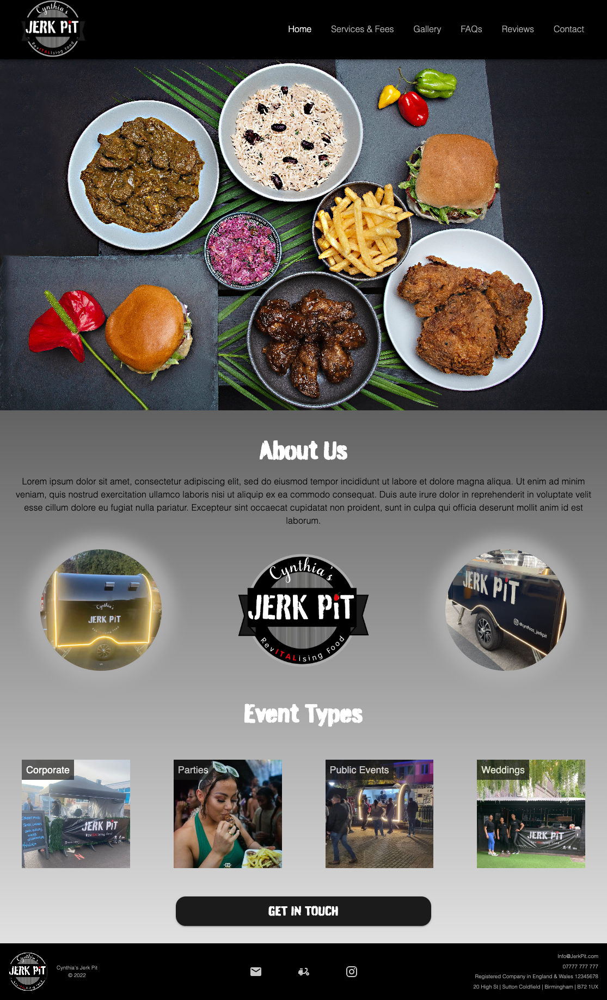
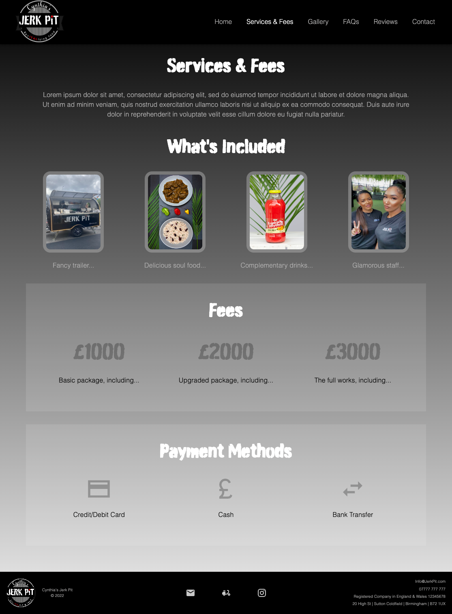
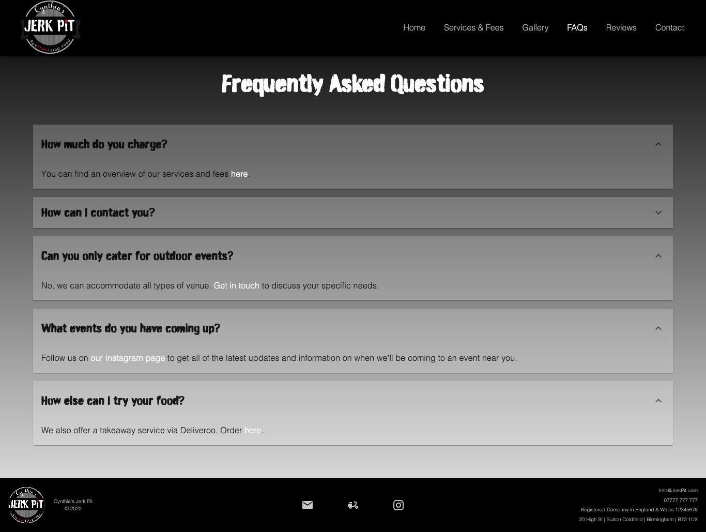
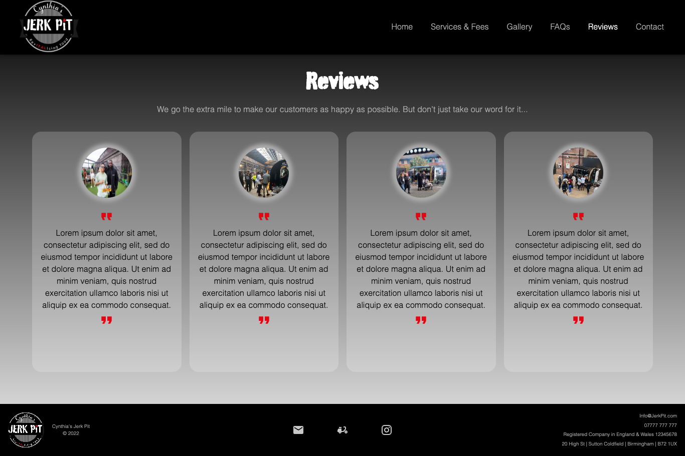

# Jerk Pit 

React-powered responsive app to advertise the services of a local business.

[Deployed URL](https://c-sim.github.io/jerk-pit/)

## Technologies

- React
- CSS
- MUI
- EmailJS

## Screenshots

<details>
<summary>Homepage</summary>



</details>

<details>
<summary>Services & Fees</summary>



</details>

<details>
<summary>FAQs</summary>



</details>

<details>
<summary>Reviews</summary>



</details>

</br>

## User Story

```md
AS A customer who is interested in hiring the business to cater an event
I WANT to access details on what is included in the service and contact details so I can get in touch
SO THAT I can arrange a booking
```
